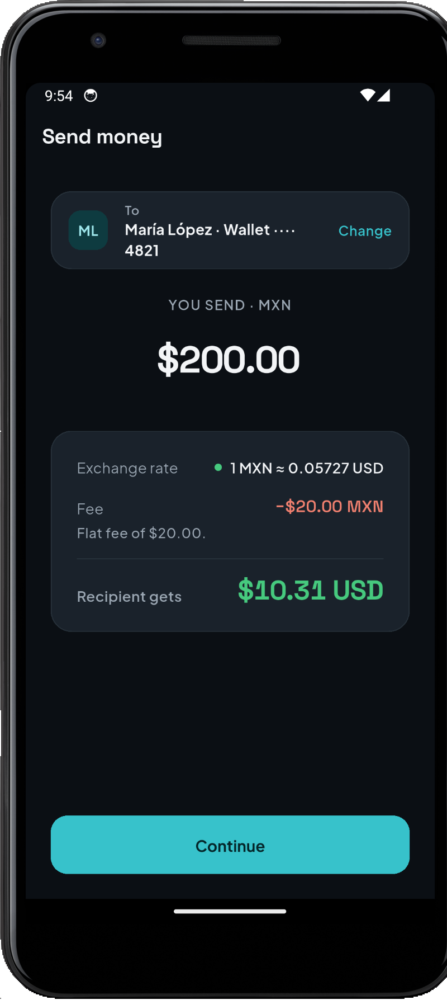
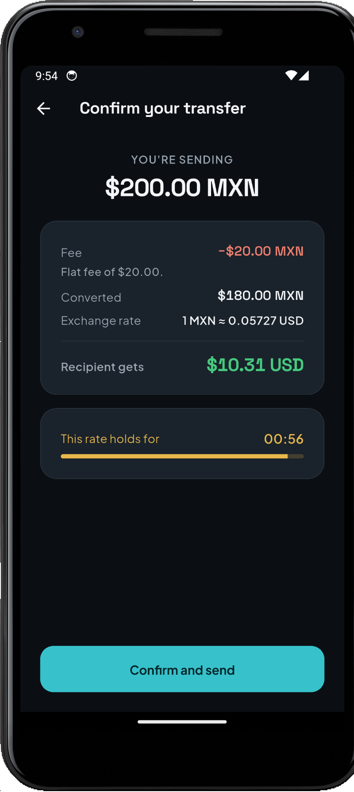
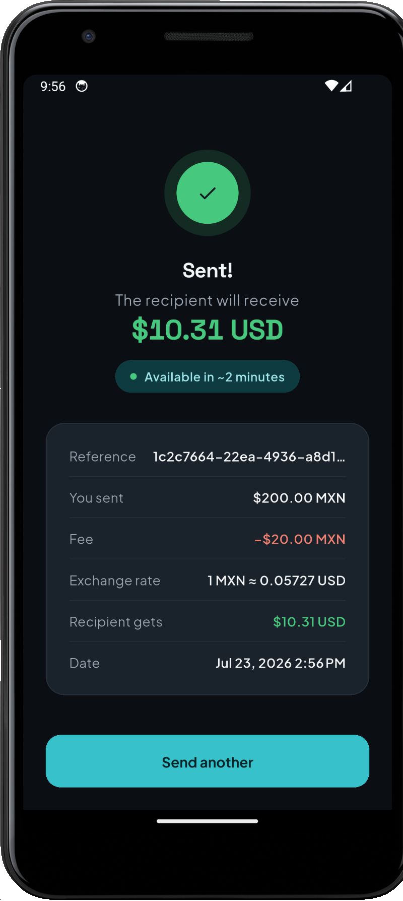
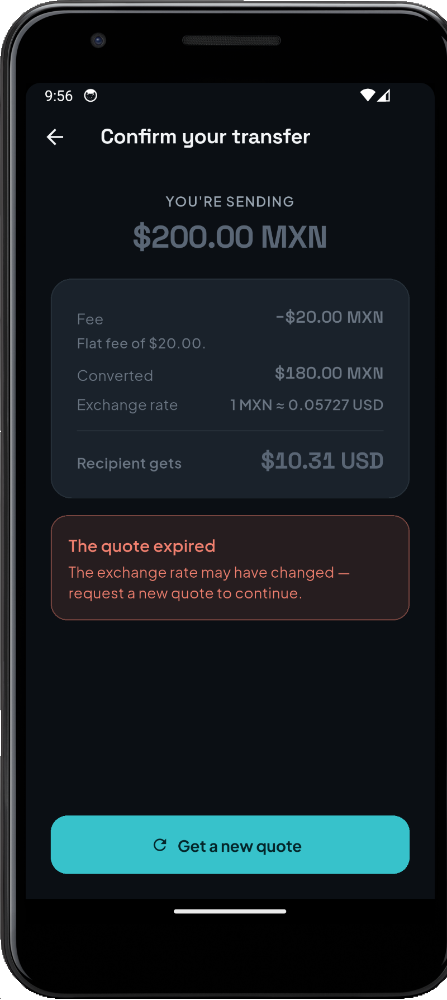

# bmoni-transfer

Vertical slice **MXN → USD**: quote and confirm a transfer, **retry-safe**.
Node/TS backend (`backend/`) + Flutter app (`app/`).

- **The contract** (endpoints, entities, business rules, acceptance criteria)
  lives in [.specs/features/mxn-usd-transfer.md](.specs/features/mxn-usd-transfer.md) — source of truth.
- **The why** behind every technical decision is in [DECISIONS.txt](DECISIONS.txt).

---

## Screenshots

| Amount entry | Confirmation | Result |
|:---:|:---:|:---:|
|  |  |  |

<details>
<summary>Edge cases (loading, network error, invalid input, expired quote)</summary>

| Expired quote |
|:---:|
|  |

</details>

---

## Requirements

| Tool | Version used |
|---|---|
| Node    | ≥ 22 (LTS, ESM) |
| Flutter | 3.44.x (stable) — Dart 3.9 |

No database needed: the backend's state is in-memory behind a repository
port (swappable for a real DB later).

---

## How to run the app (quick start)

Two terminals, in this order:

```bash
# Terminal 1 — backend
cd backend && npm install && npm run dev
# -> listening on http://localhost:3000

# Terminal 2 — app (with an Android emulator already running)
cd app && flutter pub get && flutter run
```

The Android emulator talks to the local backend with no extra config
(`10.0.2.2` is the default — see the scenarios table below for iOS/physical device).

---

## Backend (`backend/`)

```bash
cd backend
npm install
npm run dev          # tsx watch — http://localhost:3000
```

Quick check:

```bash
curl http://localhost:3000/health                     # {"status":"ok"}
curl "http://localhost:3000/api/v1/quote?amount=1000" # MXN→USD quote
```

Scripts:

| Script | What it does |
|---|---|
| `npm run dev`       | Watch-mode server (tsx), no build step |
| `npm run build`     | Compiles TS to `dist/` (tsc) |
| `npm start`         | Runs the build (`node dist/main.js`) — used in prod |
| `npm test`          | Vitest suite (unit + integration with supertest) |
| `npm run typecheck` | `tsc --noEmit` |
| `npm run lint`      | Biome check |

### Configuration (env vars)

All have a safe default for development; the server validates with Zod on
startup and **fails fast** if anything is invalid. Amounts are declared in
major units (MXN) and converted to cents once they enter the domain.

| Var | Default | Note |
|---|---|---|
| `PORT`             | `3000` | |
| `NODE_ENV`         | `development` | In `production`, a non-default `HMAC_SECRET` is required |
| `CORS_ALLOWLIST`   | `http://localhost:8080` | Comma-separated origins (no wildcard) |
| `RATE_PROVIDER`    | `frankfurter` | `frankfurter` (ECB, no API key) or `stub` (deterministic) |
| `RATE_CACHE_TTL_MS`| `60000` | In-memory rate cache TTL |
| `QUOTE_TTL_MS`     | `60000` | How long a quote stays valid |
| `FEE_FLAT_MXN`     | `20` | Flat fee below the threshold |
| `FEE_THRESHOLD_MXN`| `5000` | Percent fee kicks in above this amount |
| `FEE_PERCENT`      | `0.01` | 1% above the threshold |
| `MIN_AMOUNT_MXN`   | `10` | |
| `MAX_AMOUNT_MXN`   | `100000` | |
| `HMAC_SECRET`      | *(dev fallback)* | **Required** in production — signs the quote |

---

## Flutter app (`app/`)

```bash
cd app
flutter pub get
flutter run          # points at the local backend by default
```

The backend endpoint is injected at build time via `--dart-define BASE_URL`.
The **default is `http://10.0.2.2:3000`** (host loopback from the Android
emulator), so a plain `flutter run` already talks to the backend running on
your machine.

| Scenario | Command |
|---|---|
| Android emulator → local backend | `flutter run` (default `10.0.2.2:3000`) |
| iOS simulator / desktop → local backend | `flutter run --dart-define BASE_URL=http://localhost:3000` |
| Physical device → backend on your LAN | `flutter run --dart-define BASE_URL=http://<your-machine-IP>:3000` |

Tests and analysis:

```bash
flutter analyze
flutter test
```

No public deploy or distributed APK: for this take-home, running both sides
locally is enough (see [DECISIONS.txt](DECISIONS.txt) § What was cut).

---

## API (summary)

Base path: `/api/v1`. Full detail and acceptance criteria in the
[spec](.specs/features/mxn-usd-transfer.md).

| Method | Path | Description |
|---|---|---|
| `GET`  | `/health` | Liveness → `{ "status": "ok" }` |
| `GET`  | `/api/v1/quote?amount=<MXN>` | Quotes; returns `quoteId`, breakdown and `expiresAt` |
| `POST` | `/api/v1/transfers` | Confirms. `Idempotency-Key` header **required**; body is just `{ "quoteId" }` |

Money travels as **integer minor units** (`{ minorUnits, currency }`), never
as decimals. The client **never** sends or recomputes rate/fee/USD: it sends
only the `quoteId`, and the backend recalculates from the stored quote (see
[DECISIONS.txt](DECISIONS.txt)).

---

## Structure

```
bmoni-transfer/
├── backend/   Node/TS — hexagonal-light (domain / application / infrastructure)
├── app/       Flutter — Clean Arch feature-first (transfer: domain / data / presentation) + core + shared
└── .specs/    SDD spec (source of truth for the contract)
```
